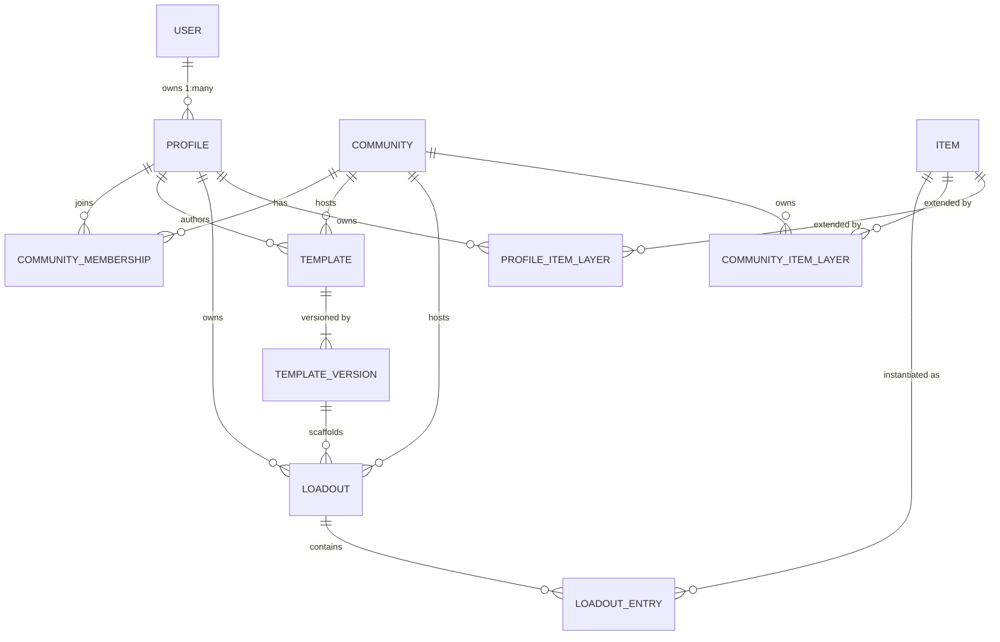

# Loadouts — Day 0 MVP Implementation Plan

> **Goal:** Take the concept document (Thesis, User Profiles, Object Model) and land a
> *thin-but-complete vertical slice* of **every** element of the object model:
> `Item` (Global / Community / User-Public / User-Private layers), `User`, `Profile`,
> `Template` (versioned), `Loadout`, and `Community`.
>
> **Day 0 philosophy:** every concept exists end-to-end (model → store → service → API → UI),
> nothing is "phase 2 stubbed out", but each concept is implemented at the *simplest correct*
> fidelity. Depth (auth, search infra, moderation, monetization) comes later.

Branch: `feature/day0-mvp`

---

## 1. Where we are today (pre-existing)

| Area | State |
| --- | --- |
| `backend/internal/core` | `Item`, `UserMetadata`, `SchemaDefinition`, `Supplier`, `ItemSource`, deep-merge, JSON-Schema validation |
| `backend/internal/db` | `Store` interface + `MemoryStore` + `PostgresStore` (items/schemas/user metadata/sources) |
| `backend/internal/service` | `InventoryService` (+ bloom filter negative cache) |
| `backend/api/handlers` | `/api/v1/items`, `/api/v1/schemas` |
| `backend/migrations` | `0001` schemas/items/user_metadata/aggregates, `0002` images, `0003` suppliers/sources |
| `frontend` | React + Vite + Tailwind "thick client": telescoping loadout editor, 4x8 grid, mock DB garage |

**Gap vs. the concept:** there is no `User`, no `Profile`, no `Community`, no `Template`,
no persisted `Loadout`, and the metadata layering only has 2 of the 4 layers
(global + user), with no community layer and no public/private split semantics.

---

## 2. Day 0 object model (target)



### 2.1 Metadata layering (the core "hard" bit)

Resolution order for an item, evaluated in a **view context** (`viewer profile`, optional `community`):

```
1. Global base           items.base_metadata                     (public, immutable-ish)
2. Community layer       community_item_layers.metadata          (public, scoped to community)
3. User public layer     profile_item_layers.public_metadata     (public, scoped to profile)
4. User private layer    profile_item_layers.private_metadata    (ONLY if viewer == owner)
```

- Each layer is a namespaced map (`{"ul_backpacking": {"ul_score": 7.8}}`), deep-merged left→right.
- Namespaces are validated against the **Schema Registry** on write (already exists).
- The response carries `_layers` provenance (`{"ul_score": "community:ul_backpacking"}`) so the UI
  can show "this value came from your community / your override".
- Private layer is *never* serialized for a non-owner viewer. Enforced in the service, not the handler.

### 2.2 Templates

- `Template` = identity + ownership (`platform` | `profile` | `community`).
- `TemplateVersion` = immutable `{version:int, slots:[]SlotDefinition, changelog}`.
  Publishing never mutates an existing version → existing loadouts never break.
- `SlotDefinition`: `{id, name, accepted_categories[], required, min, max, position}`.
- A built-in `platform/freeform` template v1 exists with zero fixed slots (the "generic template"
  from the concept: add anything without structure).

### 2.3 Loadouts

- `Loadout` = `template_id` + `template_version` + owner profile + optional community +
  visibility (`private` | `unlisted` | `public`) + entries.
- `LoadoutEntry` = `{id, slot_id, parent_entry_id?, item_id, quantity, note, position}`.
  `parent_entry_id` preserves the existing telescoping/nesting UX (pack → pocket → ditty bag).
- Draft vs saved: `status = draft | published`. A draft is just an unsaved-to-feed loadout.
- **Fork** (`POST /loadouts/{id}/fork`) copies entries into a new loadout owned by the caller —
  this is the "discover then remix" loop from the Lurker persona.
- Validation against the template version: required slots filled, item category accepted, max count.
  Warnings (not hard errors) on `save` so drafts stay ergonomic; hard error on `publish`.

### 2.4 Identity (Day 0 scope)

- No passwords, no OAuth. A `DevAuth` middleware reads `X-Profile-ID` (fallback `X-User-ID`)
  and resolves the acting `Profile`. This is an explicit, documented Day-0 shortcut with a single
  swap point (`internal/auth`) for real auth later.
- `User` 1:many `Profile`; all authored content hangs off `Profile`.

---

## 3. Work breakdown

### Phase 1 — Domain types (`internal/core`)
- [ ] `identity.go`: `User`, `Profile`.
- [ ] `community.go`: `Community`, `CommunityMembership`, `MemberRole` (`member|admin|owner`).
- [ ] `template.go`: `Template`, `TemplateVersion`, `SlotDefinition`, `OwnerType`.
- [ ] `loadout.go`: `Loadout`, `LoadoutEntry`, `Visibility`, `LoadoutStatus`, `LoadoutStats`.
- [ ] `layers.go`: `CommunityItemLayer`, `ProfileItemLayer`, `LayerContext`, `ResolvedItem`
      (merged metadata + `_layers` provenance + sources).
- [ ] Extend `merger.go` with `ResolveLayers(item, community, profile, viewerIsOwner)`.
- [ ] Keep `UserMetadata` as a thin alias/adapter so existing endpoints keep working.

### Phase 2 — Storage
- [ ] Extend `db.Store` with: profiles/users, communities+memberships, community item layers,
      profile item layers, templates+versions, loadouts+entries, discover query.
- [ ] `MemoryStore`: full implementation (this is the Day-0 default, no DB needed to run).
- [ ] `PostgresStore`: full implementation, `sqlx`, same style as existing methods.
- [ ] `migrations/0004_day0_object_model.sql`: users, profiles, communities, community_members,
      community_item_layers, profile_item_layers, templates, template_versions, loadouts,
      loadout_entries + indexes. Also migrates `user_metadata` → `profile_item_layers`.

### Phase 3 — Services (`internal/service`)
- [ ] `identity.go` — `IdentityService`: create user, create/list/get profile, resolve actor.
- [ ] `community.go` — `CommunityService`: create/list/get, join/leave, role checks,
      set community item layer (admin-gated).
- [ ] `template.go` — `TemplateService`: create template (+v1), publish new version, list/get,
      seed the platform `freeform` template.
- [ ] `loadout.go` — `LoadoutService`: create from template, add/move/remove entries, save,
      publish, fork, delete, discover feed, compute stats (weight/base weight/cost, recursive).
- [ ] `InventoryService`: add `ResolveItem(ctx, itemID, LayerContext)` + community/profile layer writes.

### Phase 4 — HTTP API (`api/handlers`)
- [ ] `internal/auth` dev-auth middleware + `CurrentProfile(ctx)`.
- [ ] CORS middleware (frontend on :5173 → backend on :8080).
- [ ] Routes:
  - `POST/GET /users`, `GET /users/{id}/profiles`
  - `POST/GET /profiles`, `GET /profiles/{handle}`, `GET /profiles/{handle}/loadouts`
  - `POST/GET /communities`, `GET /communities/{slug}`, `POST /communities/{slug}/join|leave`,
    `GET /communities/{slug}/members`, `PUT /communities/{slug}/items/{itemID}/layer`,
    `GET /communities/{slug}/templates`, `GET /communities/{slug}/loadouts`
  - `POST/GET /templates`, `GET /templates/{id}`, `GET /templates/{id}/versions`,
    `POST /templates/{id}/versions`
  - `POST/GET /loadouts`, `GET/PATCH/DELETE /loadouts/{id}`, `PUT /loadouts/{id}/entries`,
    `POST /loadouts/{id}/publish`, `POST /loadouts/{id}/fork`
  - `GET /discover` (public loadouts, filter by community/template/q)
  - `GET /items/{id}?community=&layers=` (layered resolution),
    `PUT /items/{id}/layers/profile` (public+private user layer)
- [ ] Consistent JSON error envelope `{"error": {"code","message"}}`.

### Phase 5 — Seed / demo data
- [ ] `internal/seed/seed.go`: two users, three profiles, two communities
      (`ul-backpacking`, `nyc-fashion`), the UL community item layer (`ul_score`, `comfort`,
      `durability`), the platform freeform template, a `Basic Backpacking` community template,
      the real gear items from the frontend mock DB, and two public loadouts.
- [ ] Auto-seeded when running with `MemoryStore` (`SEED=1`, default on for memory).
- [ ] Refresh `scripts/seed.sh` to exercise the new endpoints via curl.

### Phase 6 — Tests
- [ ] `core`: layered merge order + private-layer redaction + provenance.
- [ ] `core`: template version immutability, slot validation.
- [ ] `service`: loadout create → add entries → validate → publish → fork.
- [ ] `service`: community join/leave + admin-only layer writes.
- [ ] `api`: httptest smoke run of the primary happy path.

### Phase 7 — Frontend (thin client on real API)
- [ ] `src/api/client.ts` — typed fetch wrapper, injects `X-Profile-ID`.
- [ ] `src/api/types.ts` — mirrors Go JSON.
- [ ] `src/state/SessionContext.tsx` — active profile + profile switcher.
- [ ] `HomeView` → real loadouts for the active profile + "New Loadout" (template picker).
- [ ] `DiscoverView` → real `/discover` feed, community filter, open + **Fork**.
- [ ] `CommunitiesView` → list/join/leave, community templates & loadouts, item layer editor.
- [ ] `GarageView` → items from API, item detail drawer showing the 4 layers + provenance.
- [ ] `LoadoutEditor` → slots come from the template version, entries persist to the API,
      stats from the backend, keeps drag/drop + telescoping.
- [ ] Graceful offline fallback to the existing mock data when the API is unreachable
      (so the prototype still demos with no backend).

### Phase 8 — Docs & verification
- [ ] `README.md` — new architecture, object model, how to run.
- [ ] `backend/TESTING.md` — new curl flows.
- [ ] `implementation.md` — append Day-0 decisions.
- [ ] `go build ./... && go test ./...` green; `npm run build` green.

---

## 4. Day 0 non-goals (explicitly deferred)

| Deferred | Why it's safe to defer |
| --- | --- |
| Real auth / sessions / OAuth | Dev-auth middleware is a single swap point |
| Redis merged-item cache | Merge is cheap at prototype scale; interface already isolates it |
| Real search (GIN / Elastic) | `ILIKE` + in-memory filter is enough for the demo corpus |
| Community moderation, reporting | Roles exist (`owner/admin/member`); enforcement hooks are in the service |
| Affiliate price refresh workers | Sources model already landed; refresh is a cron concern |
| Template migration functions | Versions are immutable, so nothing breaks without them |
| Image uploads | URLs only |

---

## 5. Acceptance criteria

1. A user can be created, own 2 profiles, and switch between them in the UI.
2. A profile can create a community, another profile can join it.
3. A community admin can attach `{ul_score, comfort, durability}` to a global item, and that
   metadata appears **only** when viewing in that community's context.
4. A profile can override global item metadata (public) and attach a private note that is
   invisible to other viewers.
5. A profile can create a versioned template, publish v2, and v1-based loadouts are unaffected.
6. A profile can create a loadout from a template, fill slots (including nested containers),
   see computed weight/base-weight/cost, and publish it publicly.
7. Another profile can discover that loadout, view it, and fork it into their own account.
8. `go test ./...` and `npm run build` both pass.

---

## 6. Delivery status

All eight acceptance criteria are met. Verified by `go test ./...`, `npm run build`, and
`backend/scripts/smoke_day0.sh` (end-to-end against a running server).

| Phase | Status |
| --- | --- |
| 1. Domain types | Done — `identity.go`, `community.go`, `template.go`, `loadout.go`, `layers.go`, `ids.go`, `errors.go` |
| 2. Storage | Done — extended `Store`, full `MemoryStore` + `PostgresStore`, migration `0004` |
| 3. Services | Done — identity, community, template, loadout, layered item resolution |
| 4. HTTP API | Done — dev auth, CORS, `/healthz`, JSON error envelope, all routes |
| 5. Seed | Done — `internal/seed`, auto-runs on the in-memory store |
| 6. Tests | Done — `core/layers_test.go`, `service/platform_test.go`, `service/loadout_test.go` |
| 7. Frontend | Done — API client, session/profile switcher, Home, Discover, Communities, Garage, editor |
| 8. Docs | Done — README, TESTING, implementation notes |

### Deviations from the plan

> [!NOTE]
> **Offline fallback → explicit offline screen.** The plan called for falling back to the old
> mock dataset when the API is unreachable. Keeping a second, silently-diverging source of
> truth is a trap, so the app now shows exactly which command to run instead. The mock
> database and the unused earlier prototype under `src/{features,hooks,data,types}` were
> deleted.

> [!NOTE]
> **API smoke test → shell script instead of `httptest`.** `scripts/smoke_day0.sh` exercises
> the real server over HTTP and doubles as living documentation of the flows, which was worth
> more at Day 0 than an in-process handler test. The service layer beneath it is unit-tested.

> [!IMPORTANT]
> The frontend had **no `tsconfig.json`**, so `npm run build` was silently skipping both the
> type check and the Vite build (`tsc` printed its help text and the `&&` short-circuited).
> Added `tsconfig.json` / `tsconfig.node.json`; the build now genuinely type-checks.

