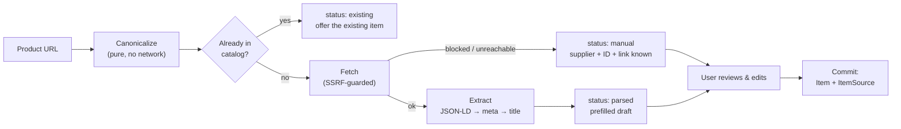

# Item Importing — Design Notes

How a retailer product URL becomes a catalog item, and why it is built the way it is.

## The problem

Curating gear is the tedious part of the product. Nobody wants to hand-type "Big Agnes
Copper Spur HV UL2, shelter, 1360g, $549.95" for forty items. But scraped data is
imperfect, retailers actively block scrapers, and a wrong weight silently corrupts every
loadout an item lands in. The design has to be useful when scraping works and still
useful when it doesn't.

## Pipeline



Each stage is independently testable, and the first stage is pure string logic.

## Key decisions

### Canonicalization is separate from fetching, and never touches the network

`Canonicalize` turns a URL into `(supplier, productID, canonicalURL)` by string parsing
alone. This is the single highest-value piece of the feature, because it is what survives
when everything else fails:

| We can always... | Even when the page is unreadable |
| --- | --- |
| Identify the retailer | ✅ |
| Extract the product ID (ASIN, REI number, Shopify handle) | ✅ |
| Build a correct affiliate link | ✅ |
| Dedupe against the existing catalog | ✅ |

Tracking parameters are stripped so the same product shared from a phone, a search result,
and an affiliate link all collapse to one entry.

### A blocked retailer is a degraded success

Amazon returns 503/403/500 to datacenter traffic — this is not an edge case, it is the
normal outcome. Treating it as an error would make the headline retailer permanently
broken. Instead the preview returns `status: "manual"` with the target, the affiliate URL,
and a plain-language warning, and the user fills in the rest.

> [!NOTE]
> Verified against live traffic during development: Amazon returned HTTP 500 and REI
> returned HTTP 403. Both produced correct, usable manual-entry previews.

### An SSRF-blocked host is *not* a degraded success

The one fetch failure that is a hard error. There is no legitimate import behind
`169.254.169.254`, and falling back to manual entry would leave a catalog item pointing at
internal infrastructure. Two layers of defense:

1. `Dialer.Control` validates the resolved IP at dial time — covering the initial host,
   every redirect hop, and DNS rebinding in one place.
2. A hostname check inside `Canonicalize`, because **`Commit` never fetches**; without it
   a user could hand-create an item pointing anywhere.

### Two steps: preview writes nothing, commit writes what was confirmed

Scraped data is a suggestion. The user sees an editable card and confirms it; the server
persists exactly what they approved and does not re-scrape. A failed scrape therefore
never leaves a half-created item behind.

### Missing values stay missing

`Draft` carries `has_weight` / `has_price` alongside the values. A form field prefilled
with `0` would look filled in and quietly produce a weightless item; a blank field with a
"not found on page" hint prompts the user. Weight matters most because `core.weight_g` is
what the entire stats engine runs on.

### Imports enter the global catalog immediately, flagged

`origin=import, verified=false`. Everyone benefits from an import right away, but the
provenance is never lost, so moderation can be layered on later without a backfill.
Hand-curated seed items are `origin=curated, verified=true`, so the "unverified" badge
means something.

### Extraction without an HTML parser

The ladder is JSON-LD → OpenGraph/meta → `<title>`. Most modern retailers emit
`schema.org/Product` JSON-LD, so one generic parser covers REI, Backcountry, Patagonia and
every Shopify storefront.

We deliberately did not add `golang.org/x/net/html`. The two constructs we need
(`<script type="application/ld+json">` bodies and `<meta>` tags) are narrow, well-formed,
machine-generated patterns. Regex on arbitrary HTML would be a mistake; regex on these two
is a reasonable trade for zero new dependencies.

Real-world shape variance that the extractor handles, all covered by tests:
`@graph` wrappers, `@type` as an array, image as string / array / `ImageObject`, brand as
string / object, price as JSON number / string, `AggregateOffer` with `lowPrice`,
HTML-escaped JSON-LD bodies, and non-`Product` nodes that must be skipped.

### Unit normalization

`"2 lb 3 oz"` → `992.23g`. Compound values sum. UN/CEFACT unit codes (`GRM`, `KGM`, `ONZ`,
`LBR`) from `QuantitativeValue` are mapped. Prices go to integer cents via
`int64(v*100 + 0.5)` to avoid `54.95 * 100 == 5494.999...`.

If no weight field exists anywhere, a weight in the product name is used as a last resort
("BRS 3000T Stove - 25g" → 25g).

## Adding a retailer

Append one entry to `suppliers` in [`internal/importer/url.go`](loadouts/backend/internal/importer/url.go):

```go
{
    ID: "moosejaw", Name: "Moosejaw",
    BaseURL: "https://www.moosejaw.com",
    AffiliateTemplate: "{{.BaseURL}}/product/{{.ProductID}}?aff=loadouts",
    Hosts: []string{"moosejaw.com"},
    extract: func(u *url.URL) string { /* pull the product ID out of the path */ },
}
```

Extraction is generic, so usually nothing else is needed. Add a matching row to the
`suppliers` table (or let `ImportService.Commit` upsert it from the registry on first use).

Unknown hosts fall through to the generic `other` supplier, whose affiliate template is a
passthrough — so importing from an unsupported store works, it just isn't monetized.

## What's deliberately not here

| Deferred | Why |
| --- | --- |
| Amazon Product Advertising API | Needs an approved affiliate account (3 sales in 180 days). The URL path works today without it. |
| Browser extension / bookmarklet | The right long-term answer for bot-hostile retailers, since the user's browser has their cookies. Much larger surface area. |
| Scheduled price refresh | `item_sources.last_updated` and the upsert path exist for it; no scheduler yet. |
| Bulk / multi-URL import | Single-URL flow first; the service API is already shaped for it. |
| Image rehosting | We store the retailer's image URL and hotlink it. |
| Moderation queue for unverified imports | The `verified` flag and its partial index exist; no review UI yet. |

## Tests

- `internal/importer/url_test.go` — canonicalization across 9 real URL shapes, the
  dedupe-across-variants property, internal-host rejection, unit and category parsing.
- `internal/importer/extract_test.go` — the three extraction tiers against realistic
  retailer markup, plus the JSON-LD shape variance listed above.
- `internal/importer/fetch_test.go` — the SSRF guard, including an end-to-end check that
  fetching a real loopback HTTP server is blocked at dial time.
- `internal/service/import_test.go` — preview/commit, blocked-retailer fallback,
  provenance, dedupe, validation, ID collisions, unknown retailers, and an end-to-end
  check that an imported item actually moves loadout stats.
- `scripts/smoke_import.sh` — 10-section live API run, independent of whether any real
  store is reachable.
