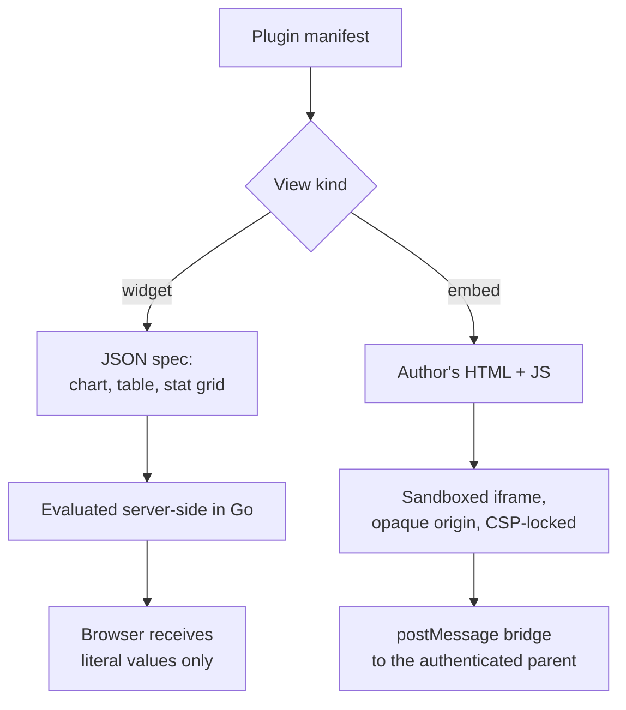

# The Plugin Model — Design Notes

How a user or a community extends the product's UI, and why an untrusted author is allowed
to do it at all.

## The problem

Every hobby measures itself differently. Ultralight backpackers rank gear by a score the
platform has never heard of. Cyclists want gear ratio calculators. A trip report wants a
map. We cannot ship a feature for each of these, and we should not try: the people who
know what the view should look like are the communities, not us.

So the platform has to let strangers add UI. That is the whole difficulty. A plugin author
is, by definition, someone we have no reason to trust, and the things they want to build
range from "a pie chart of my pack weight" to "an interactive Google Map with a saved GPX
track". Those two needs are so far apart that trying to serve both with one mechanism
produces either a toy or a security incident.

## Two tiers, because power and trust trade off



| | Widget | Embed |
| --- | --- | --- |
| Author ships | A JSON spec | HTML and JavaScript |
| Runs | Server-side, in Go | In a sandboxed iframe |
| Can execute code on our origin | Never | Never |
| Can reach the network | No | Only allowlisted hosts |
| Good for | Charts, tables, derived numbers | Maps, canvases, anything interactive |
| Failure mode | Publish-time 400 | One dead card |

Most plugins only need the first tier, and the first tier is the safe one. The second tier
exists so that the ceiling is high enough to be worth building on.

## Key decisions

### A widget author ships data, never code

A `WidgetSpec` describes what to read, how to filter it, and what expressions produce each
number. The host evaluates it and hands the frontend a `WidgetRender` containing nothing
but values and display strings.

This asymmetry is the point. The browser never sees an expression, so there is nothing for
a malicious author to smuggle through and nothing for the frontend to accidentally
evaluate. `WidgetView.tsx` is a dumb renderer by construction, not by discipline.

It also means a broken expression is caught when the author publishes, not when a reader
opens the page. Everything in a manifest is parsed and validated at publish time:

```
unparseable expression -> 400  missing closing parenthesis for sum
unknown function       -> 400  unknown function "exfiltrate"
nested aggregate       -> 400  sum() cannot contain another aggregate
unknown surface        -> 400  view "v" targets unknown surface "admin.panel"
embed with no html     -> 400  embed view "v" has no html
```

### The embed sandbox has no credentials, on purpose

Embed frames are served with `sandbox="allow-scripts"` and **deliberately without**
`allow-same-origin`. Granting both together voids the sandbox entirely — the frame can
simply reach into its own origin and remove the attribute.

The consequence is the interesting part: an opaque origin has no cookies, so **the frame
cannot call our API at all**, even if the author tries. Everything privileged goes through
`postMessage` to the parent window, and the parent is the authenticated party. The author
gets a familiar-looking SDK:

```js
Loadouts.ready(async (ctx) => {
  const saved = ctx.data.route;          // this plugin's own stored data
  await Loadouts.save('route', { ... }); // relayed by the parent, which is authorized
});
```

Every one of those calls is a request to the host, which decides whether to honour it.
There is no path where the frame acts on its own authority.

Frames are additionally served from a separate `SANDBOX_BASE` origin, locked down with a
`default-src 'none'` CSP, and restricted to being framed by `APP_ORIGIN` alone. None of
that is load-bearing on its own; it is depth behind the sandbox attribute.

### Capabilities are default-deny and recorded on the install

A manifest declares what it needs; an install records what was granted. Rendering
intersects the two, so a manifest can only ever narrow:

| Capability | Grants |
| --- | --- |
| `loadout:read` | The loadout being viewed |
| `items:read` | Resolved item data on its entries |
| `community:read` | The community catalog |
| `storage:write` | Its own namespaced key-value storage |
| `network:<host>` | That host, and only that host, in the frame's CSP |

An install must grant everything the manifest asks for — a partial grant is a 400, not a
silent downgrade — so the user always sees the complete list before anything runs.

### Installs pin a version

Publishing v2 cannot change behaviour someone already approved. An install pins a version
and stores its granted capabilities; if a later version asks for more, that surfaces as
`MissingCaps` and the upgrade waits for a fresh grant. This mirrors how loadouts pin
template versions, for the same reason.

### Secrets go to the frame but not to the page

A per-install setting marked `secret` (a Maps API key, say) is handled two different ways
depending on where it is going:

- **Install listings redact it** to `••••••`. A widget's output is drawn directly onto the
  page, so anything reachable from a widget context can end up rendered as text.
- **Embed contexts receive the real value.** A Maps key is only useful in the browser, and
  the frame is isolated from everything else.

The asymmetry looks inconsistent until you notice the two contexts have different blast
radii. It is enforced in `redactSecrets`, not at the call sites.

### Plugins cannot become a read primitive

Rendering a loadout surface routes through `LoadoutService.Detail`, which enforces
`IsVisibleTo`. A plugin therefore cannot see a private loadout its viewer could not already
open — installing one grants access to *your* view of the data, not to the data.

Item-scoped plugin storage is **read-only** for the same family of reasons: items are
global, so a writable item scope would let anyone who installs a plugin edit data every
other user sees. That needs moderation tooling that does not exist yet.

### One broken plugin is one broken card

A view that fails to render comes back carrying an `error` rather than being absent, and
the host draws it in its own box. A surface with three plugins where one is broken shows
two working plugins and one message — never a failed request, and never a blank page.

Related small choices in the same spirit:

- Division by zero evaluates to `null`, so a widget renders a blank cell instead of an
  error page.
- Table aggregates range over the **full filtered set**, not the truncated page, so a
  "percent of total" column stays honest under a row limit.
- Every author-controlled dimension has a ceiling (12 stats, 16 columns, 250 rows,
  32 chart points, 1000-character expressions, 64 KB per stored value), because an
  unbounded dimension in untrusted input is a denial-of-service surface.

## Surfaces

| Surface | Mounted in | Scope for storage |
| --- | --- | --- |
| `loadout.panel` | Below the slot grid in the editor | loadout |
| `loadout.sidebar` | The stats rail | loadout |
| `item.tab` | The item inspector | item (read-only) |
| `community.tab` | A community page | community |

## The expression language

A small, total expression language over the rows a widget iterates. Arithmetic and
comparison, `&&`/`||`/`!`, dotted paths, string and math helpers, a lazy
`if(cond, a, b)`, and the aggregates `sum`/`avg`/`min`/`max`/`count`, which re-evaluate
their argument once per row:

```
sum(item.weight_g * entry.quantity)
percent(item.weight_g, sum(item.weight_g))
if(item.consumable, item.weight_g * entry.quantity, 0)
item.metadata.ul_backpacking.ul_score != null
```

Core item numbers are hoisted to the top level (`item.weight_g`), while community and user
metadata keeps its namespace (`item.metadata.ul_backpacking.ul_score`). That second form is
what makes plugins worth having: the host has no idea what a `ul_score` is, the community
defined it, and a plugin makes it legible.

> [!NOTE]
> `percent` the *format* appends a sign to a 0–100 value; it does not scale a fraction.
> Use the `percent(part, whole)` *function* to produce it. Writing `x / sum(x)` with
> `format: percent` renders `0.4%` where you meant `36.3%`.

## The bundled examples

Three plugins ship with the demo seed, chosen so that between them they exercise every axis
the manifest has:

| Plugin | Tier | Exercises |
| --- | --- | --- |
| `weight-breakdown` | Widget, pie chart | The simple case: reads a loadout, no configuration |
| `ul-score` | Widget, table + stat grid | A community metadata layer, a declared schema, two views in one plugin |
| `trip-route` | Embed | A third-party script, a per-install secret, and plugin-owned storage |

If a fourth kind of plugin cannot be written as a variation on one of these, the manifest
is missing something.

## What is deliberately not here

- **No plugin marketplace, ratings, or moderation.** Anyone can publish; installs are
  opt-in per profile, and community admins install for a community.
- **No server-side plugin code.** No WASM, no sandboxed JS runtime on the backend. The
  widget tier covers the computation people actually want, and the embed tier covers the
  rest in the browser where isolation is somebody else's well-tested problem.
- **No cross-plugin data access.** Storage is namespaced per plugin with no sharing.
- **No background jobs or webhooks.** A plugin renders when someone looks at it.
