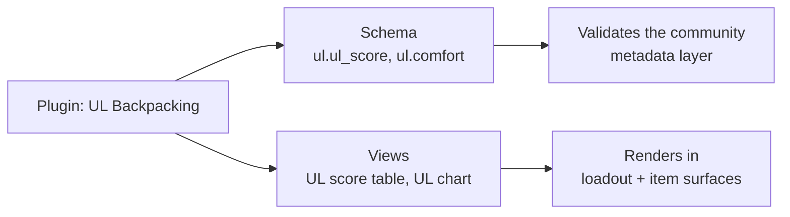

# Plugin Model — Implementation Plan

How users and communities publish plugins that add views — charts, calculators, data
tables, maps — to the Loadouts UI.

---

## 1. Why this shape

Two requirements pull against each other:

- **Anyone can author a plugin.** Authors are untrusted by definition.
- **Plugins should be genuinely powerful.** Google Maps routes, interactive charts,
  custom visualizations.

Handing untrusted JavaScript to the host page would satisfy the second and destroy the
first: plugin code would run with the viewer's session and full DOM access. So the model
is two tiers, and which tier a plugin uses is a property of its manifest:

| Tier | Mechanism | Power | Trust required |
| --- | --- | --- | --- |
| **Widget** | JSON spec evaluated server-side, rendered by host components | Charts, tables, stat grids, computed formulas | None — no author code ever executes |
| **Embed** | Author HTML/JS in a `sandbox`ed iframe, `postMessage` bridge | Anything, incl. third-party SDKs like Maps | Isolated by the sandbox, gated by declared capabilities |

Most plugins people actually want ("show me weight by category", "rank my gear by
grams-per-dollar") are the widget tier, which is why it exists rather than making
everything an iframe.

> [!IMPORTANT]
> The embed iframe is rendered with `sandbox="allow-scripts"` and **without**
> `allow-same-origin`. That combination gives the frame an opaque origin, so it cannot
> reach the parent document, cookies, or storage. Adding `allow-same-origin` alongside
> `allow-scripts` would silently make the sandbox meaningless.

## 2. Plugins own both halves of a concept

`core.SchemaDefinition` is already documented as *"a validation schema for a plugin's
metadata"* — the data half of a plugin system exists and is wired into layer validation.
This plan makes a plugin own **both** halves:

A plugin is therefore the natural unit for "this community's way of describing gear",
rather than a parallel concept bolted next to schemas.

## 3. Object model

Mirrors the Template model, which already solved versioning and pinning.

| Entity | Purpose |
| --- | --- |
| `Plugin` | Identity, ownership (platform/profile/community), visibility, `latest_version` |
| `PluginVersion` | Immutable published manifest + changelog |
| `PluginManifest` | Views, capabilities, schemas, settings definitions |
| `PluginInstall` | A plugin enabled in a scope (profile or community), **pinned to a version**, with granted capabilities and per-install settings |
| `PluginDatum` | Plugin-namespaced storage, keyed by (plugin, scope, key) |

Installs pin a version for the same reason loadouts pin a template version: a plugin
update must never silently change what a user already approved.

### Surfaces

Named extension points the host renders into:

| Surface | Where |
| --- | --- |
| `loadout.panel` | Full-width panel on loadout detail |
| `loadout.sidebar` | Card in the loadout stats sidebar |
| `item.tab` | Tab in the item inspector |
| `community.tab` | Tab on a community page |

### Capabilities

Declared in the manifest, granted at install time, enforced server-side:

- `loadout:read`, `items:read`, `community:read` — what context the host will hand over
- `storage:write` — plugin-namespaced persistence
- `network:<host>` — outbound hosts the embed sandbox may contact (becomes the frame CSP)

## 4. Widget tier: a small, safe expression language

The widget tier needs computed values to be useful ("grams per dollar", "% of base
weight"), which means an expression evaluator. It is deliberately **not** a scripting
language:

- field paths (`item.metadata.core.weight_g`, `entry.quantity`)
- arithmetic, comparison, boolean logic, conditionals
- a fixed function set (`sum`, `avg`, `min`, `max`, `count`, `round`, `if`, `coalesce`)
- no assignment, no loops, no host access, no recursion

Evaluation happens **server-side** in Go, producing a render model the frontend draws.
That keeps the evaluator unit-testable, keeps the frontend dumb, and means a malformed
expression is a 400 rather than a broken page.

Widget types: `stat_grid`, `bar_chart`, `pie_chart`, `table`.

## 5. Work breakdown

| Phase | Scope | Status |
| --- | --- | --- |
| 1 | Domain types: plugin, manifest, views, capabilities, installs, data | ✅ |
| 2 | Expression evaluator + widget evaluation, with heavy unit tests | ✅ |
| 3 | Store methods (interface, memory, Postgres) + migration `0006` | ✅ |
| 4 | Services: publish/version, install/grant, render views, plugin storage | ✅ |
| 5 | HTTP API + authz | ✅ |
| 6 | Sandbox host route (serves embed HTML with CSP) + plugin bridge SDK | ✅ |
| 7 | Frontend: surface host, SVG chart components, iframe bridge, plugin manager | ✅ |
| 8 | Example plugins: weight breakdown (widget), UL score table (widget + schema), trip route map (embed) | ✅ |
| 9 | Docs, smoke script | ✅ |

Writing the example plugins in phase 8 — using only the public API, as an author would —
turned up two bugs that the unit tests had not:

- `ListInstalls` passed its query parameters straight to the store, so omitting the scope
  returned every install on the platform to an anonymous caller.
- Nested aggregates (`sum(sum(x))`) were rejected by the evaluator but not the parser, so
  such a plugin published cleanly and then failed on every render — breaking the rule that
  a bad expression is a publish-time error.

Both are fixed with regression tests. Building the examples last, against the real API, is
what found them.

## 6. Day 0 non-goals

| Deferred | Why |
| --- | --- |
| Plugin marketplace / discovery ranking | Listing and install is enough to prove the model |
| Author-hosted embed URLs | Day 0 embeds are inline HTML stored in the manifest, so authoring needs no hosting |
| Plugin-initiated writes to item/loadout metadata | Read + own-namespace storage only; widening this needs a permission story |
| Server-side plugin execution | No untrusted code runs on our servers, ever |
| Billing / paid plugins | — |
| Cross-plugin dependencies | — |

## 7. Acceptance criteria

1. A profile can publish a plugin and a second version; existing installs stay pinned.
2. A community admin can install a plugin for a community; a non-admin cannot.
3. An installed widget plugin renders a chart on loadout detail, computed from real
   loadout data via the expression language.
4. An installed embed plugin renders in a sandboxed iframe, receives its context over
   `postMessage`, and can persist data scoped to the loadout.
5. A plugin cannot read data it has no capability for, and cannot read another plugin's
   stored data.
6. A malformed expression or manifest is rejected at publish time with a useful message.
7. An embed plugin cannot reach the parent document (verified by the sandbox attributes
   and the absence of `allow-same-origin`).
