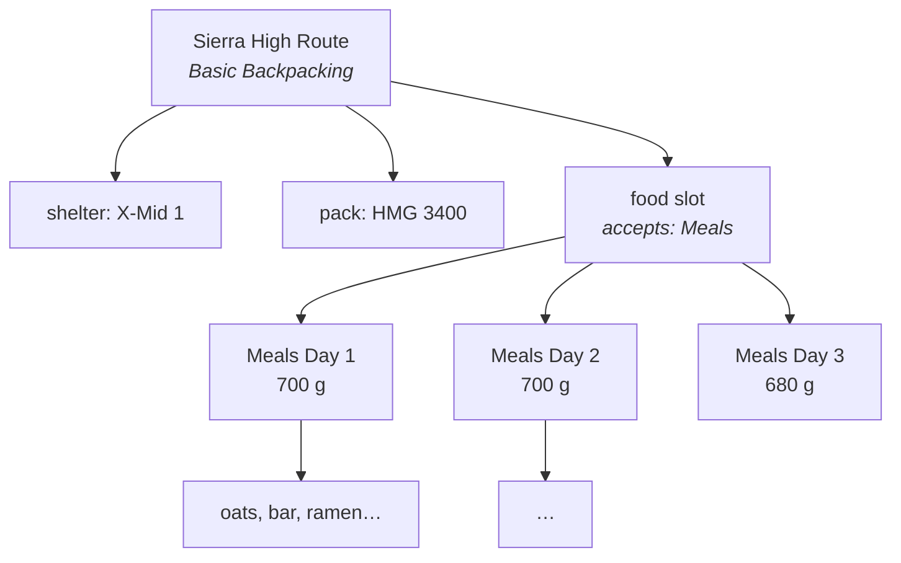

# Recursive Templates — Implementation Plan

Letting a template slot accept *another loadout* instead of an item, so a "Food" slot in a
backpacking template can hold "Meals Day 1", "Meals Day 2", and "Meals Day 3".

## 1. The idea

Today a slot accepts item categories. A `SlotDefinition` says "shelter goes here" and a
`LoadoutEntry` puts one item in it. That is enough for a flat kit list and not enough for
the way people actually pack.

Real kits are composed. A three-day trip's food is not one item, it is three days of meals,
each of which is its own little kit you assemble, reuse, and tweak. Today you either flatten
all of it into the parent (losing the structure) or keep three separate loadouts with no
relationship to the trip (losing the rollup). Both are wrong.



The parent's total weight includes all 2,080 g of food. Each day is a real loadout you can
open, publish, fork, and reuse on the next trip.

## 2. Decisions

### A sub-loadout is a reference to an independent loadout

Not an owned child, and not a copy. "Meals Day 1" is a first-class loadout: it appears in
your shelf, it can be published to a community, someone can fork it, and you can attach the
same one to three different trips. That reusability is the entire reason to build this —
an owned child is just `ParentEntryID` nesting with extra steps, and a copy throws away the
thing that makes it interesting.

The cost is that references can dangle, cycle, and cross visibility boundaries. Sections 3
and 4 are mostly about paying that cost honestly.

### Slots choose how their children roll up

A `SlotDefinition` gains a `selection` mode:

| Mode | Meaning | Rollup |
| --- | --- | --- |
| `sum` (default) | You carry all of them | Every child's stats are added |
| `alternatives` | They are options you are choosing between | Only the selected child counts |

Both are needed, and the two readings of "swipe through the Food slot" are exactly why.
Three days of meals is `sum` — you carry all of it, and a total that ignored two days would
be a lie. Three candidate tents is `alternatives` — you are comparing, and adding them up
would be nonsense. The same UI affordance (swipe between children in a slot) serves both;
only the arithmetic differs.

For `alternatives`, exactly one child entry carries `Selected: true`. Making selection an
explicit field rather than "whichever sorts first" means reordering the UI cannot silently
change your pack weight.

### Depth is capped at 5, and cycles are refused outright

A depth cap alone does not make cycles safe — it just bounds how long you spin before
giving up, and it would let `A → B → A` exist in the database as a permanent trap for every
future reader. So both, at write time:

- **Cycles are rejected** when you attach. `A → A` and any longer loop.
- **Depth is capped** such that no chain through the graph exceeds 5 loadouts.

The depth check has to look both ways. Attaching child `C` under parent `P` is legal only
when `depthAbove(P) + 1 + heightBelow(C) <= 5`, because attaching a 3-deep subtree to
something that is already 3 deep breaks the invariant for everyone above `P`, not just for
`P`. That needs a reverse lookup ("who references this loadout?"), which is an index on
`child_loadout_id`.

Enforcing at write time means readers can trust the data. The renderer still carries a
defensive depth guard, in the same spirit as the existing `depth > 8` check in
`buildEntryTree`, but it should never fire.

### You may only attach a sub-loadout you own

A loadout has exactly one owner: the profile that created it. That profile is the only
party that can create, edit, or delete it. Attachment follows: you may hang a loadout off
your slot only if it is yours.

The rule exists because of a leak. The visibility answer chosen for this feature is that a
private sub-loadout inside a public parent renders as a placeholder *with its weight still
counted* — otherwise the public total is simply wrong, which is worse than coy. That is
fine when the discloser and the owner are the same party: you are revealing your own
aggregate, and the contents stay hidden.

It is not fine across parties. If Alice publishes "Secret Meals", Bob attaches it to his
public trip, and Alice then makes it private, Bob's trip would keep broadcasting Alice's
weight and cost — and keep tracking her edits — to everyone, forever. Owner-only
attachment means the only aggregate ever disclosed this way belongs to whoever chose to
disclose it.

Using someone else's kit is served, and served better, by **fork-then-attach**: a fork
gives you a copy you can actually edit, which is what you wanted anyway. Fork already
exists.

> [!NOTE]
> Attaching a private loadout to a public parent discloses that sub-loadout's weight, cost,
> and item count — just not its contents or its name. That is a deliberate trade for honest
> totals, and the placeholder should say so plainly rather than pretending nothing is there.

#### Rejected: community- and platform-owned loadouts

This was built and then removed. The reasoning for it went: the best use of this feature is
a community's canonical sub-kit — an "UL Backpacking 3-Season Meal Kit" that every member
hangs off their trip's food slot — so `Loadout` should gain `OwnerType`/`OwnerID` mirroring
`Template`, and attachment should require authority over the *child's owner* rather than
personal ownership.

It worked, and it cost too much. Polymorphic ownership dragged in a three-way authority
check on every mutation, a service-level `canView` to compensate for `IsVisibleTo` being
unable to recognise a community admin, an ownership-transfer operation with authority
checks on both ends, and a second owner column that had to stay consistent with the author
column forever.

What killed it is that the payoff was also a misfeature. A shared, centrally-edited kit
means a mod editing the canonical meal kit silently changes the weight of trips that were
planned months ago. **A trip's numbers should never move because someone else edited
something.** Fork-then-attach gives every member a stable snapshot they control, which is
what you actually want from a packing list.

The genuine need underneath — *"how does the community point at the good kit?"* — is
discovery, not ownership, and it is answered by community favorites (see
`COMMUNITY_FAVORITES.md`): a community endorses a loadout it does not own, and members fork
it. Endorsement is cheap, reversible, and cannot change anyone's totals.

### Slots declare which templates they accept

`AcceptedTemplateIDs` on the slot, mirroring `AcceptedCategories`. Empty means any template.
A slot with a non-empty list is a sub-loadout slot; a slot with `AcceptedCategories` is an
item slot. A slot may not be both — that would make "what goes here?" unanswerable in the
UI, and the validator says so.

## 3. Data model

### `SlotDefinition` gains three fields

```go
AcceptedTemplateIDs []string      `json:"accepted_template_ids,omitempty"`
Selection           SelectionMode `json:"selection,omitempty"` // "sum" | "alternatives"
```

`MaxItems` already exists and already means what we need: `-1` for "as many days of food as
you like", `3` to cap it. No new capacity concept.

Template versions are immutable and loadouts pin a version, so every existing loadout is
untouched by templates that start using these fields.

### `LoadoutEntry` gains two fields

```go
ChildLoadoutID string `json:"child_loadout_id" db:"child_loadout_id"`
Selected       bool   `json:"selected" db:"selected"`
```

An entry is now either an **item entry** (`ItemID` set) or a **sub-loadout entry**
(`ChildLoadoutID` set). Exactly one, validated on write.

Keeping both kinds in the one ordered entry list — rather than adding a parallel link table
— means `Position` already gives us swipe order, a slot can mix an item with a sub-loadout
if a template ever wants that, and every existing query that walks entries keeps working.

### `ResolvedEntry` gains a sibling to `Children`

```go
Children   []ResolvedEntry  `json:"children,omitempty"`    // items inside a container item
SubLoadout *ResolvedSubLoadout `json:"sub_loadout,omitempty"` // a referenced loadout
```

These are deliberately separate fields because they are different axes. `Children` is a pot
inside a pack inside this loadout. `SubLoadout` is a different loadout entirely. Conflating
them would make the frontend guess.

```go
type ResolvedSubLoadout struct {
    LoadoutID string       `json:"loadout_id"`
    Name      string       `json:"name"`        // "" when not visible
    Visible   bool         `json:"visible"`     // false -> render the placeholder
    Missing   bool         `json:"missing"`     // referenced loadout is gone
    Stats     LoadoutStats `json:"stats"`       // counted even when not visible
    Entries   []ResolvedEntry `json:"entries,omitempty"` // only when visible
    Depth     int          `json:"depth"`
}
```

### Migration `0007`

`0007` teaches entries about sub-loadouts:

```sql
ALTER TABLE loadout_entries ALTER COLUMN item_id DROP NOT NULL;
ALTER TABLE loadout_entries ADD COLUMN child_loadout_id TEXT NOT NULL DEFAULT '';
ALTER TABLE loadout_entries ADD COLUMN selected BOOLEAN NOT NULL DEFAULT true;
CREATE INDEX idx_loadout_entries_child ON loadout_entries(child_loadout_id)
    WHERE child_loadout_id <> '';
ALTER TABLE loadout_entries ADD CONSTRAINT entry_item_xor_child_loadout CHECK (
    (item_id IS NOT NULL AND child_loadout_id = '')
    OR (item_id IS NULL AND child_loadout_id <> ''));
```

`child_loadout_id` has **no foreign key**, which is deliberate rather than lazy. We want
the reference to outlive its target: deleting "Meals Day 2" should leave the trip's food
entry in place so the UI can say the sub-loadout is gone. `ON DELETE CASCADE` erases that
evidence, and `ON DELETE SET NULL` produces a row satisfying neither half of the check
constraint, which makes the delete fail outright. Dangling is a state we want to represent,
so integrity here belongs to the service.

Because `item_id` is now nullable, `SELECT *` no longer scans into a plain Go string, so
the projection became explicit with `COALESCE`. That keeps `sql.NullString` out of
`core.LoadoutEntry` and therefore out of every caller.

## 4. Resolution and rollup

`LoadoutService.Detail` becomes a tree walk. The shape that matters:

- **Breadth-first, one batch per level.** A depth-5 tree resolved depth-first is an N+1
  storm. Fetching each level's loadouts, entries, and items in one batch per level keeps it
  to a handful of queries regardless of fan-out.
- **Memoize per loadout ID within a request**, since the same "Meals Day 1" may appear in
  two slots. Memoize the *computation*, not the *contribution*: if you genuinely attached
  the same meals twice, you are carrying it twice and it counts twice.
- **Visibility is re-checked per node** through the existing `IsVisibleTo`. A node that
  fails renders as a placeholder, contributes its stats, and exposes no entries and no name.
- **Stats roll up through `selection`.** A `sum` slot adds every child; an `alternatives`
  slot adds only the selected one.

New validation issues: `sub_loadout_missing`, `sub_loadout_wrong_template`,
`sub_loadout_depth_exceeded`, `sub_loadout_cycle` (defensive), and
`alternatives_no_selection`.

## 5. Work breakdown

| Phase | Scope | Status |
| --- | --- | --- |
| 1 | Core types: `SelectionMode`, slot fields, entry fields, `ResolvedSubLoadout`, pure graph helpers (cycle + depth) with heavy unit tests | ✅ |
| 2 | Store: `child_loadout_id` plumbing, reverse lookup `LoadoutsReferencing`, batched level reads, migration `0007`, memory + Postgres | ✅ |
| 3 | Service: attach/detach validation (ownership, cycle, depth, template match, selection), recursive `Detail` with batched level resolution and memoized stats | |
| 4 | Validation issues + publish gating | |
| 5 | HTTP API: attach/detach/select endpoints, sub-loadout-aware entry replacement | |
| 6 | Frontend: sub-loadout slot cell, swipe between children, placeholder card, nested navigation | |
| 7 | Seed: a "Meals" template and a three-day trip that uses it | |
| 8 | Docs + `smoke_recursive.sh` | |

## 6. Non-goals

| Deferred | Why |
| --- | --- |
| Attaching a loadout you do not own | The leak described above; fork-then-attach covers it |
| Community- or platform-owned loadouts | Tried and removed — see the rejected-design note above. Community favorites answer the real need |
| Auto-creating a sub-loadout from an empty slot | Nice UX, but it is a frontend flow over existing endpoints |
| Recursive plugin surfaces (a widget that sums across the whole tree) | The tree is exposed to plugins as data; aggregating it is a follow-up |
| Co-ownership of one loadout by several profiles | One loadout, one owner. Shared editing wants per-loadout ACLs, which is a different feature |
| Templates that reference themselves for a "repeat N times" shorthand | A cycle by construction; wants a different feature (slot multiplicity) |
